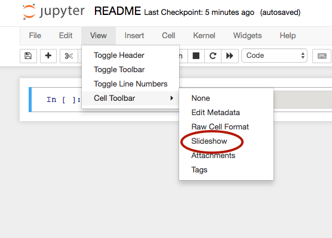
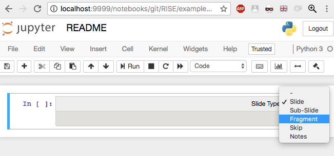
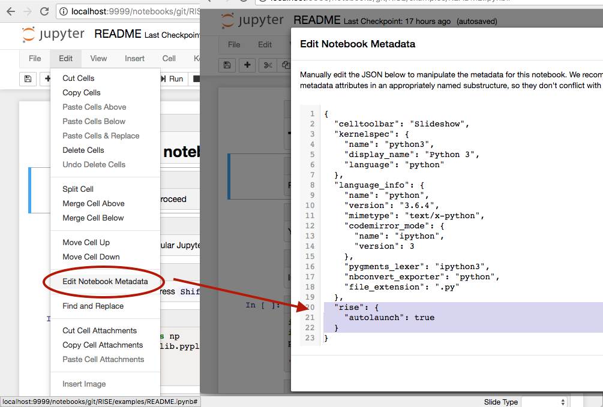
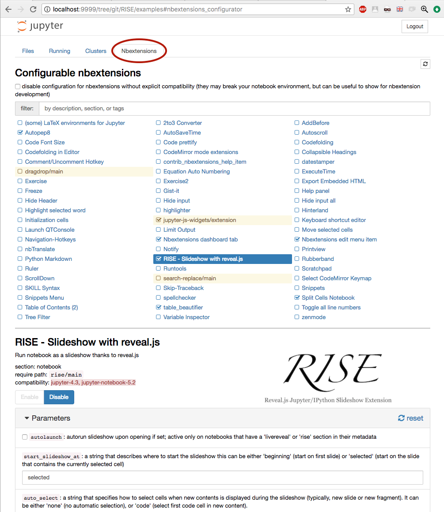

# Jupyter notebook template

## tl;dr
0. Install requirements
```
conda install -c anaconda jupyter
conda install -c conda-forge jupyter_contrib_nbextensions rise
```
1. Clone directory
```
git clone https://github.com/matjesg/WI3JMU.git
```
2. Start the jupyter-notebook server
```
jupyter notebook
```
3. Open `template_presentation.ipynb`
4. Open notebook meta data and edit placeholders in *overlay*: `<div class='header'> ...</div>` 
```
{
 ...
 "rise": {
     "overlay": "<div class='background'><div class='logo'></div><div class='bar'></div><div class='header'>Veranstaltung</br>Semester</br>Lehrstuhl für XYZ<br>Prof. Dr. XX</div>"
 }
}
```

## How to create slideshows
### Step 1: enable slideshow cell toolbar


### Step 2:  add appropriate tag to each cell
From the cell toolbar...



or, in command mode, use keyboard shortcuts

* `shift-i` : toggle slide
* `shift-b` : toggle subslide
* `shift-g` : toggle fragment

## Requirements

Installation instructions using conda (see https://docs.anaconda.com/anaconda/install/)
- Jupyter Notebook 
```
conda install -c anaconda jupyter
```
- [jupyter-contrib-nbextensions](https://jupyter-contrib-nbextensions.readthedocs.io/en/latest/install.html)
```
conda install -c conda-forge jupyter_contrib_nbextensions
``` 
- [RISE](https://github.com/damianavila/RISE/) plugin 
```
conda install -c conda-forge rise
```

For pdf export: 
- Decktape  
```
npm install -g decktape
```
Installation via NPM (see https://docs.npmjs.com/downloading-and-installing-node-js-and-npm)

## Customization

Adapted from the [RISE documentation](https://rise.readthedocs.io/en/stable/index.html).

You can define *overlay* to build a constant background. It is wrapped in a `<div>` so it can be text or html. In this case, the user is entirely responsible for styling.

RISE looks for two css files to apply CSS changes on top of the slideshow view:

- rise.css will be applied to all notebooks in the current directory (see example)
- the_notebook_name.css will be applied to the_notebook_name.ipynb.

Both files need to be placed alongside with the notebook of interest, i.e. in the same directory. 

__a. Customize each notebook using the notebook metadata__



1. Start the jupyter-notebook server
```
jupyter notebook
```
2. Open `template_presentation.ipynb`
3. Open notebook meta data and edit placeholders in *overlay*: `<div class='header'> ...</div>` 
```
{
 ...
 "rise": {
     "overlay": "<div class='header'>Veranstaltung</br>Semester</br>Lehrstuhl für XYZ<br>Prof. Dr. XX</div>..."
 }
}
```

You can also configure 
- presentation theme
- transiton between slides
- auto-launch presentation mode
- vertical scrollbar
- chalkboard capabilities
- keyboard shortcuts

For more information, read the [RISE docs](https://rise.readthedocs.io/en/maint-5.5/customize.html#what-to-configure)

__b. Customize RISE globally__


1. Start the jupyter-notebook server
```
jupyter notebook
```
2. Open jupyter-contrib-nbextensions, e.g.:
```
http://localhost:8888/nbextensions/
``` 




## Export as pdf

1. Start the jupyter-notebook server (you don’t have to start the RISE presentation, you don’t even have to open any notebook at all):
```
jupyter notebook
```

2. Run decktape with:
```
decktape rise <Jupyter-Notebook-URL><?token=xxx><Output-File>
```

More concretely, it looks something like the following:
```
decktape rise -s 2000x1200 http://localhost:8888/notebooks/template_presentation.ipynb?token=1cb4ccc638b75a62a81821a919da954c06f9623797e9e292 template_presentation.pdf
```
Here, s defines the size of the slides deck viewport: <width>x<height> (e.g. '1280x720'). See the [decktape docs](https://github.com/astefanutti/decktape#90).

For more information, read the [RISE docs](https://rise.readthedocs.io/en/maint-5.5/exportpdf.html#using-decktape)


